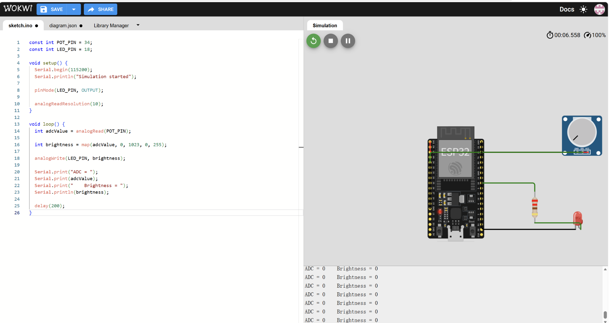
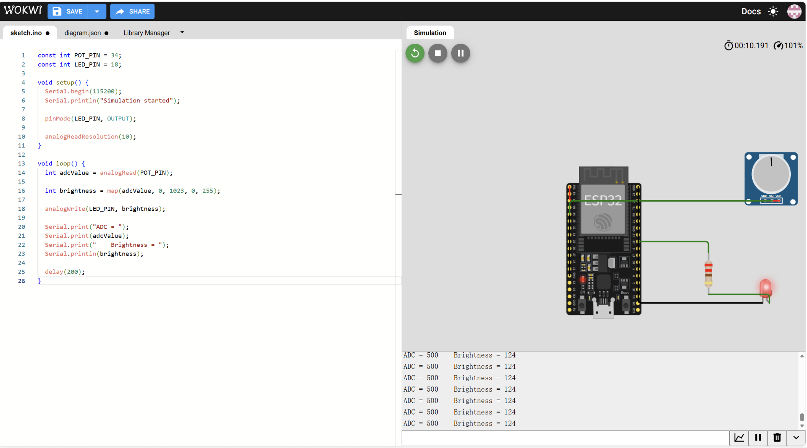

# Sensors and Actuators - Module 0 Pre-Study

**Student:** Mei Zhengyong  
**Course:** Sensorik und Aktorik (WS 2026/27)  

> This file is written to match the course pre-study structure. Add two Wokwi screenshots before committing: (1) circuit, (2) Serial Monitor/Plotter output.

## 1. Big Picture: Sensor -> Conditioning -> ADC -> MCU -> System -> Actuator

Example device I own: **smartphone microphone / voice recorder**.

```text
Sound pressure
    ↓
MEMS microphone (transducer)
    ↓
Analog front-end / filtering / amplification
    ↓
ADC or digital microphone conversion (PDM/I2S)
    ↓
Phone SoC / microcontroller-side audio processing
    ↓
Operating system + voice-recorder app
    ↓
Speaker / headphones (actuator, if played back)
```

The key point is that the phone does not directly measure "sound" as a number. The microphone converts pressure variation into an electrical signal, the signal is conditioned and digitized, and software interprets the samples.

## 2. Required Wokwi Mini-Exercise

### Circuit
- ESP32 DevKit
- Potentiometer: signal -> GPIO34, VCC -> 3.3 V, GND -> GND
- LED: GPIO18 -> 220 ohm resistor -> LED -> GND

Use the supplied `sketch.ino` and `diagram.json`.

### Observation
With a **12-bit ADC**, the ideal integer range is **0-4095**, so the full-scale range contains **4096 discrete levels**. With a **10-bit ADC**, the range becomes **0-1023**, so there are **1024 discrete levels**.

Changing from 12 bits to 10 bits changes the **resolution**: the number of available digital levels is reduced by a factor of four, so the quantization step becomes four times coarser. This does **not automatically change the physical accuracy** of the measurement. Accuracy also depends on reference voltage, offset, gain error, noise, non-linearity, wiring, and calibration.

In the normal 10-bit mapping, the potentiometer value is mapped smoothly to LED brightness. For example, the simulation produced values such as `ADC = 95, Brightness = 23`, `ADC = 500, Brightness = 124`, and `ADC = 890, Brightness = 221`.

For the coarse-step test, the brightness mapping was temporarily changed to:

```cpp
int brightness = (adcValue / 256) * 85;
```

This creates only four brightness levels: approximately **0, 85, 170, and 255**. The screenshots show, for example, `ADC = 508 -> Brightness = 85`, `ADC = 720 -> Brightness = 170`, and `ADC = 890 -> Brightness = 255`. The LED therefore changes in visible jumps instead of smoothly because many ADC input values are mapped to the same output level.

### Wokwi Evidence
**Wokwi simulation:** [Open the simulation in Wokwi](https://wokwi.com/projects/476869641648482305)
**12-bit simulation running**


**10-bit simulation running**



**Normal 10-bit mapping with Serial Monitor**



**Coarse-step mapping**


## 3. Datasheet Notes

### 3.1 VL53L0X Time-of-Flight distance sensor

- **Measured quantity:** absolute distance to a target.
- **Physical principle:** Time-of-Flight using a 940 nm VCSEL emitter and SPAD detector array. The sensor estimates distance from the travel time of emitted/reflected light.
- **Supply voltage:** 2.6-3.5 V at the IC/module level specified in the ST datasheet.
- **Interface:** I2C, up to 400 kHz.
- **Address:** the ST datasheet lists `0x52` as the I2C address byte; in 7-bit I2C notation this corresponds to `0x29`, which is what many Arduino libraries use. The address is programmable.
- **Range:** up to about 2 m under favorable conditions; guaranteed/typical range depends strongly on reflectance and ambient infrared light.
- **Resolution:** reported distance is in millimetres through the ranging API; effective measurement resolution is limited by noise and timing, not only the integer format.
- **Accuracy:** condition-dependent. ST gives a high-accuracy profile of **< +/-3%** around 1.2 m with a 200 ms timing budget. Standard-deviation figures in the datasheet vary with target reflectance, distance, ambient light, and timing budget.
- **Response/timing:** configurable ranging profiles; examples include about 20 ms high-speed, about 30-33 ms standard/long-range, and 200 ms high-accuracy timing budgets.
- **Temperature dependence:** offset drift is specified across -20 to 70 deg C; calibration matters.
- **Important limitations:** target reflectance, ambient IR/daylight, cover glass/crosstalk, FoV coverage, offset calibration, and timing budget affect valid range and accuracy.

Source: STMicroelectronics, *VL53L0X Datasheet*, DS11555 Rev. 6 (2024).

### 3.2 MPR121 capacitive touch sensor controller

- **Measured quantity:** change in electrode capacitance caused by a finger/object near a touch electrode.
- **Physical principle:** constant-current capacitive sensing; touch is detected from the difference between filtered electrode data and a tracked baseline.
- **Supply voltage:** 1.71-3.6 V depending on regulator configuration; 2.0-3.6 V when using the internal regulator in the normal higher-voltage configuration.
- **Interface:** I2C, up to 400 kHz.
- **Address:** hardware selectable: `0x5A`, `0x5B`, `0x5C`, or `0x5D`; `0x5A` is the common default when ADDR is tied to ground.
- **Channels / range:** 12 touch electrodes plus one proximity channel; capacitance sensing is intended from roughly 10 pF upward and depends on electrode design.
- **Resolution:** 10-bit filtered electrode data, nominally 0-1024 counts.
- **Accuracy:** the datasheet does not give one simple absolute touch "accuracy" value because the result depends heavily on electrode geometry, parasitic capacitance, supply, thresholds, noise, and environment. For this sensor, repeatability, threshold margin, baseline tracking, and false-touch immunity are more useful performance measures than a single accuracy number.
- **Response time:** configurable through sample period and digital filters; sample periods from about 1 ms to 128 ms are supported.
- **Temperature:** operating range -40 to +85 deg C; environmental and baseline drift must be handled by filtering/tracking.
- **Important limitations:** supply noise, long/high-capacitance electrodes, EMC/noise, threshold selection, baseline drift, grounding, and electrode layout can cause false or missed touches.

Source: NXP/Freescale, *MPR121 Proximity Capacitive Touch Sensor Controller Datasheet*, Rev. 4 (2013).

## 4. Measurement and Uncertainty Basics

### True value, error, and uncertainty
- **True value:** the ideal physical value we would like to know. In practice it may be unknowable exactly.
- **Measurement error:** measured value minus the reference/true value.
- **Measurement uncertainty:** an interval/estimate describing how much doubt remains in the reported result.

Example: if a reference distance is 500 mm and the VL53L0X reports 510 mm, the observed error relative to that reference is +10 mm. A result should still be reported with an uncertainty because repeated measurements, reflectance, temperature, and alignment cause variation.

### Accuracy vs. precision
- **Precise but not accurate:** a bathroom scale repeatedly reads 1.0 kg too high. Values are tightly grouped but biased.
- **Accurate but not precise:** a thermometer gives 19.2, 20.8, 20.0, 19.7, 20.3 deg C around a 20.0 deg C reference. The average is close, but individual readings scatter.

### Resolution vs. accuracy
A 12-bit ADC has 4096 codes, but fine code spacing does not guarantee that each code represents the real input accurately. Offset, gain error, reference error, noise, non-linearity, and sensor errors can all be larger than one LSB.

### Systematic vs. random error
- **Systematic error:** repeatable bias. Calibration is the main way to reduce/correct it.
- **Random error:** unpredictable scatter. Repeated measurements and averaging/filtering can reduce its effect.

### Sampling and quantization
- **Nyquist condition:** to reconstruct a band-limited signal, sampling frequency should be greater than twice the highest relevant signal frequency (`fs > 2*fmax`). In practice a margin and anti-alias filter are used.
- **Quantization:** analog values are rounded to discrete ADC codes. A small signal can be hidden when its change is smaller than one quantization step or comparable to noise.

## 5. Actuator Primer

### PWM
PWM controls the fraction of time a digital output is ON within each period. This fraction is the **duty cycle**. A higher duty cycle delivers a higher average voltage/power to loads such as LEDs. A hobby servo usually interprets pulse timing as a commanded position.

### Plain LED
A plain LED needs a current-limiting resistor because its current rises steeply once forward voltage is reached. Without current limiting, excessive current can damage the LED and/or the GPIO pin.

### WS2812 / NeoPixel
A WS2812 pixel includes an RGB LED plus a digital control IC, so many pixels can be daisy-chained and individually addressed through one data line. Unlike a single plain RGB LED, a strip can draw large current. Power therefore has to come from a properly sized external supply, not from a microcontroller GPIO.

### Servo vs. brushed DC motor vs. stepper
- **Servo:** simple position command, internal feedback, good for a latch/flap/arm over a limited angle.
- **Brushed DC motor:** simple continuous rotation; speed is easy to control, but precise position requires external feedback and a driver/H-bridge.
- **Stepper:** moves in commanded steps and is good for precise incremental positioning, but needs a driver and can consume significant current even while holding.

### Why motors and relays need drivers
GPIO pins provide logic-level control and only limited current. Motors and relay coils require much more current and generate inductive voltage spikes. A transistor, MOSFET, H-bridge, or driver IC provides current gain and protection; flyback protection is required for inductive loads.

## 6. Project Idea - Initial Abstract

### Smart Workstation Presence and Interaction Indicator

The project is a small smart-workstation node for a laboratory or shared study area. It detects whether somebody is physically present at the workstation and whether the user intentionally interacts with the station. A **VL53L0X** distance sensor measures presence/distance, while an **MPR121** touch sensor provides a deliberate touch/input channel. An **addressable WS2812 LED strip** acts as the main actuator and displays states such as free, occupied, attention needed, or user-confirmed. The node can publish measurements through MQTT and show status in Node-RED. A simple rule can create a closed loop: when presence is detected but no touch/confirmation occurs for a defined time, the LED changes its animation. The project is easy to demonstrate physically and still allows calibration, I2C address checks, latency measurements, and power-budget evaluation.

**Starting components:**
- Sensor 1: VL53L0X ToF distance sensor
- Sensor 2: MPR121 capacitive touch sensor
- Actuator: WS2812 addressable LED strip

## 7. Guiding Questions - Short Answers

1. **The chain:** smartphone microphone -> analog conditioning -> ADC/digital audio conversion -> SoC -> OS/app -> speaker/headphones when played back.
2. **Wokwi observation:** 12 bit = 4096 levels (0-4095); 10 bit = 1024 levels (0-1023). The 10-bit setting has four times coarser quantization than 12-bit. Resolution changes; physical accuracy does not automatically change.
3. **Datasheet example (VL53L0X):** I2C; address 0x52 in ST's address-byte notation / 0x29 as a 7-bit address; accuracy is condition-dependent, with a high-accuracy profile < +/-3% around 1.2 m at 200 ms under specified conditions.
4. **Accuracy vs. precision:** biased bathroom scale = precise but inaccurate; noisy thermometer centered on the reference = accurate on average but not precise.
5. **I2C anticipation:** devices share SDA/SCL, so each slave needs a unique address. Two devices with the same fixed address cause an address collision unless one address can be changed, one device is disabled, or a multiplexer/separate bus is used.
6. **Actuator choice:** choose a hobby servo for a small door latch because it provides simple position control and enough holding torque for a small mechanism. I would not choose a bare brushed DC motor because it needs extra position feedback and a driver to stop reliably at the correct angle.
7. **LED power math:** `30 x 60 mA = 1800 mA = 1.8 A` worst case at full white. Use an external 5 V supply with margin. The microcontroller 5 V rail/GPIO cannot safely provide this current; the controller should only provide the data signal, with grounds connected together.
8. **Project abstract:** Smart Workstation Presence and Interaction Indicator using VL53L0X + MPR121 + WS2812, described in Section 6.

## 8. Day-1 Checklist

- [x] Create the personal GitHub portfolio from the course template.
- [x] Copy this file into `pre-study/README.md` or `00-pre-study.md`.
- [x] Run the Wokwi project and add Wokwi evidence screenshots.
- [x] Commit `sketch.ino`, `diagram.json`, notes, screenshots, and project abstract.
- [x] Install Arduino IDE v2 or PlatformIO.
- [x] Check the course LMS for any last-minute syllabus changes before class.

